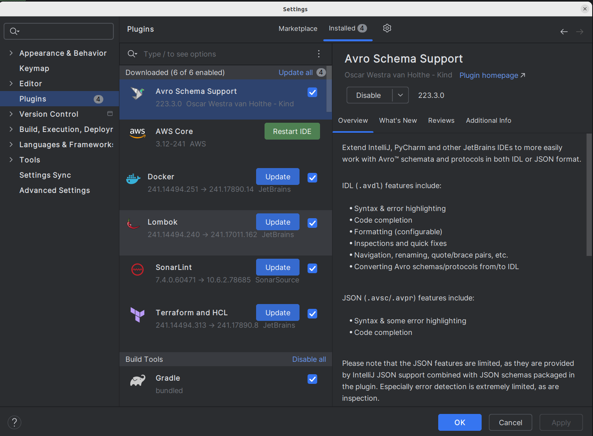

# Aplicação Spring: Projeto Saude e Bem Estar

Este projeto é uma aplicação Spring Boot que oferece uma API para fazer o gerenciamento de medicamentos, mapeamento de
atendimentos médicos e recomendações médicas.


## Requisitos não obrigatórios desenvolvidos:
 - Flyway (Migração e versionamento da base de dados)
 - Lombok (Simplificar o desenvolvimento)
 - Swagger (Documentação)
 - Aplicação rodando com Docker

## Resumo Lombok
Lombok é uma biblioteca Java que ajuda a reduzir a quantidade de código boilerplate que os desenvolvedores precisam 
escrever. Ela usa anotações para gerar automaticamente o código comum, como getters, setters, construtores, 
métodos equals, hashCode e toString, entre outros. Isso torna o código mais limpo e fácil de manter.
Aqui estão algumas das principais anotações fornecidas pelo Lombok:

- <b>@Getter</b> e <b>@Setter</b>: Gera automaticamente os métodos getter e setter para os campos da classe.
- <b>@ToString</b>: Gera um método toString que inclui todos os campos da classe.
- <b>@EqualsAndHashCode</b>: Gera métodos equals e hashCode baseados nos campos da classe.
- <b>@NoArgsConstructor</b>, @AllArgsConstructor e @RequiredArgsConstructor: Gera construtores sem argumentos, com todos os argumentos e com argumentos para os campos finais, respectivamente.
- <b>@Data</b>: Combina as anotações @Getter, @Setter, @ToString, @EqualsAndHashCode e @RequiredArgsConstructor em uma única anotação.
- <b>@Builder</b>: Implementa o padrão de projeto Builder, permitindo a criação de instâncias de objetos de forma mais legível.


## Resumo Flyway
Flyway é uma ferramenta de migração de banco de dados para Java. Ele ajuda a gerenciar as alterações no 
esquema do banco de dados ao longo do tempo, aplicando versões sequenciais de scripts SQL ou Java.

## Resumo Swagger
Swagger é um conjunto de ferramentas para criar, documentar e consumir APIs RESTful. O principal objetivo do 
Swagger é simplificar o desenvolvimento e a utilização de APIs, proporcionando uma interface interativa para 
testar endpoints e visualizar a documentação.

## Requisitos

Para executar este projeto, você precisará ter instalado:

- Java JDK 17 ou superior
- Maven
- Docker e Docker Compose

## Configuração do Projeto

Clone o repositório para sua máquina local usando:

```bash
git clone https://github.com/JeffAlexandrino/ProjFinal_Backend.git
cd saudeebemestar-service
```

## Como Executar

1 - Após o clone do projeto, acessar pelo terminal a pasta do projeto e executar o comando:
```bash
docker compose up -d
```

2 - Executar o projeto via linha de comando conforme instruções abaixo:

2.1 - Dentro do diretório do projeto, execute o seguinte comando para construir o projeto com Maven:

```bash
mvn clean install
```

2.2 - Após a construção do projeto, você pode executar a aplicação utilizando:
```bash
java -jar target/saudeebemestar-service-0.0.1-SNAPSHOT.jar
```

ou

2.2 - Alternativamente, você pode executar o projeto diretamente via Maven usando:
```bash
mvn spring-boot:run
```

2 - Se preferir executar pela IDE faça a importação do projeto e realize a instalação do plugin do Lombok na IDE para que a compilação seja realizada com sucesso.



## Detalhamento da API
Para exibir toda a documentação da API cole o comando abaixo no navegador:
```bash
http://localhost:8080/swagger-ui/index.html
```

## Collection de dados
A collection de dados com todas as chamadas para as apis estão armazenadas na pasta collection na raiz do projeto

## Obter ajuda ##
Para obter informações de ajuda, faça uma requisição GET para  http://localhost:8080/ajuda.

Exemplo de requisição:
```bash
curl http://localhost:8080/ajuda